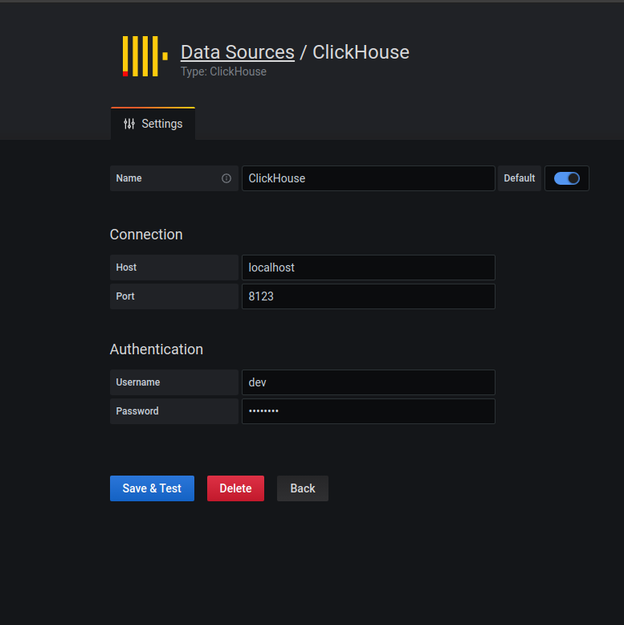
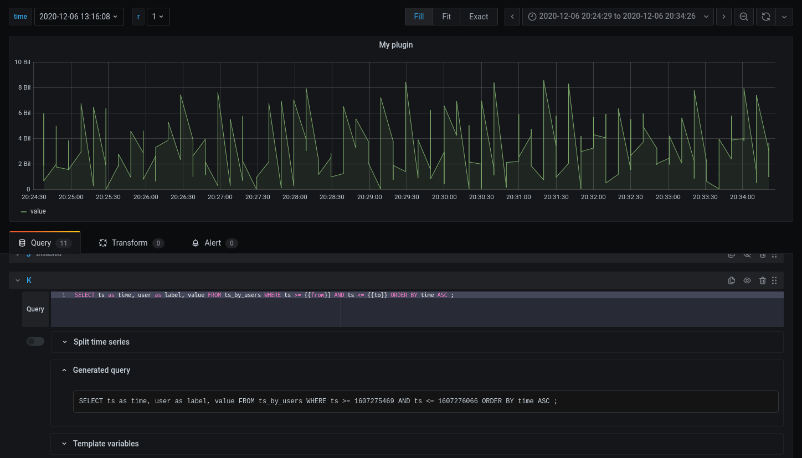
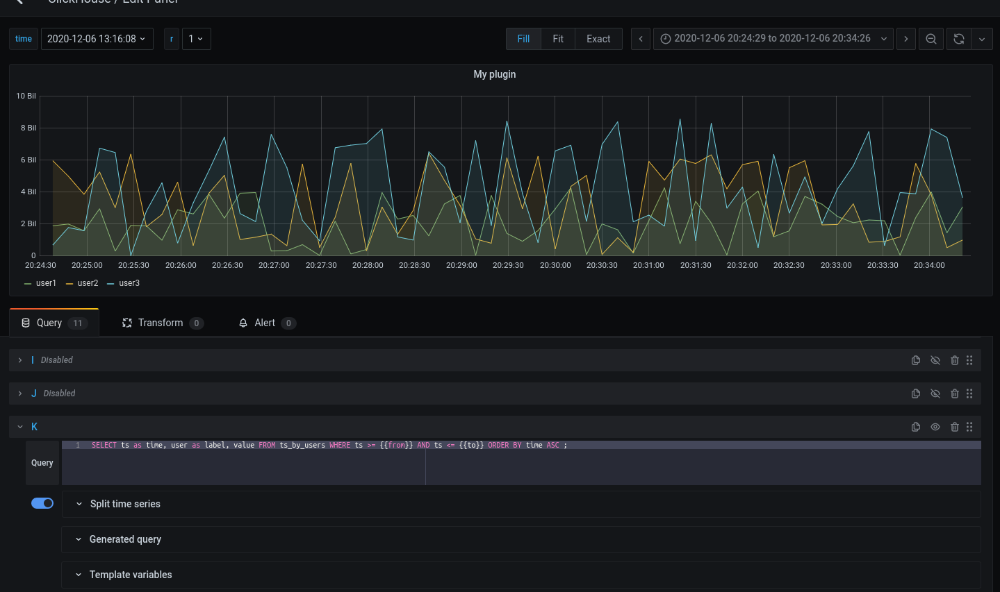
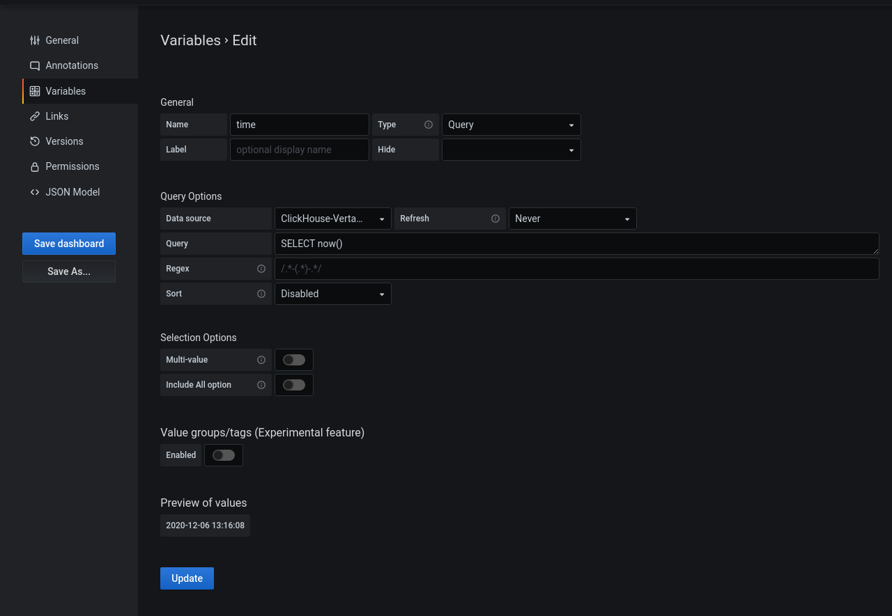

# Grafana ClickHouse Data Source Plugin

###Supports
* alerting
* annotations
* mustache templating

###Allows
* to write queries as is, not restricting columns and their types 
* to use variables

#### Datasource configuration

#### Query preview

#### Splitting data by label

#### Variables

